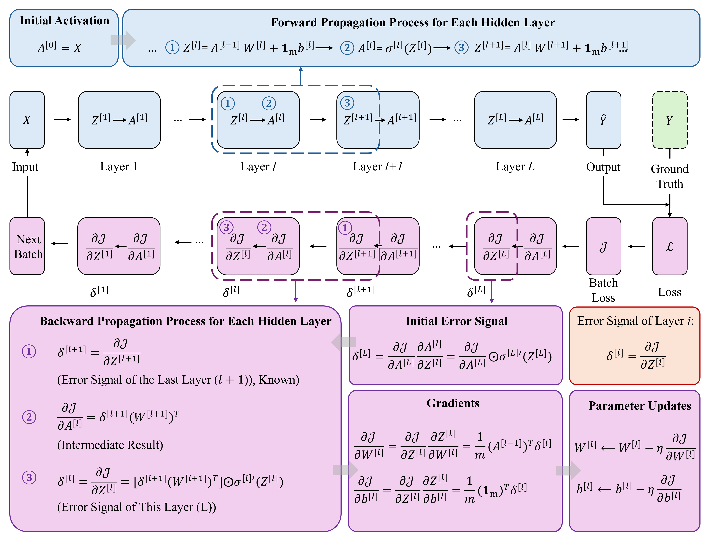

# Trainer: training and evaluation

<!-- Original section links retained for compatibility. -->
<span id="evaluate_loss-evaluate_accuracy"></span>

This follows `tiny_trainer.hpp/.cpp`. Trainer references a Sequential and an Optimizer without owning them; both must outlive it. Enable `TINY_AI_TRAINING_ENABLED` for the training API.

## Current configuration and API

| Config field | Default |
|---|---:|
| `epochs` | 50 |
| `batch_size` | 16 |
| `verbose` | true |
| `print_every` | 10 |
| `lr_decay` | 1.0 |

`fit(Dataset&, const Config&, Dataset* = nullptr)` requires Config. Evaluation uses `evaluate_loss()` and `evaluate_accuracy()`, both with default batch size 32. Accuracy is returned in 0–1.

```cpp
#include "tiny_ai.h"

void train_model(tiny::Sequential &model, tiny::Optimizer &optimizer,
                 tiny::Dataset &train, tiny::Dataset &validation)
{
    tiny::Trainer trainer(&model, &optimizer, tiny::LossType::CROSS_ENTROPY);
    tiny::Trainer::Config cfg;
    cfg.epochs = 100;
    cfg.batch_size = 16;
    trainer.fit(train, cfg, &validation);
    float accuracy = trainer.evaluate_accuracy(validation);
    (void)accuracy;
}
```

Cross entropy computes Softmax internally from logits. Do not automatically append another Softmax to a new classification model. The loop performs forward → loss → backward → optimizer step; batches preserve alignment between features and labels after index shuffling.

[Complete callable example](../../USAGE/usage.md) · [Implementation](code.md)

## Historical design and API excerpts {#auton-historical-contract}

Older definitions, defaults and schematic calls are retained for comparison. Use the current contracts above and the project headers.

<details class="auton-source" markdown="1">
<summary>Historical design and API excerpts</summary>

# TinyAI · Train · Trainer — Design notes {#notes}

!!! info "Implementation and records"
    APIs in this section are based on `CODE/AIoTNode-TinyAuton-AI/middleware/`. Source excerpts and serial output include historical records; check the project entry and enabled selectors before reproducing a test.

!!! note "Notes"
    `Trainer` ties together a Sequential model, an Optimizer, a loss type and a Dataset into a standard training pipeline, exposing `fit / evaluate_loss / evaluate_accuracy`. It lazily collects model parameters and initialises the optimiser on the first call, so application code only needs to describe "network + optimiser + loss" before training starts.

!!! abstract "Trainer — The Training Loop: Repeat forward → loss → backward → update"
    Encapsulates the classic training loop.

## Intuition {#intuition}

### One Epoch {#one-epoch}

```
for each batch:
    1. forward:    model(batch) → prediction
    2. loss:       loss_fn(prediction, label) → loss value
    3. backward:   gradient backprop → each param gets gradient
    4. step:       optimizer updates all params
```

<figure markdown="span">
  
  <figcaption>Diagram: Forward propagation (blue) and backward propagation (pink) — forward computes activations \(A^{[l]}\) layer by layer; backward propagates error signals \(\delta^{[l]}\) from the loss and computes parameter gradients</figcaption>
</figure>

### Core API {#core-api}

```cpp
Trainer trainer(&model, &optimizer);
trainer.fit(&dataset, 100, 16);    // 100 epochs, batch=16
```

### Monitoring {#monitoring}

- Loss trending down → good
- Loss oscillating → LR too high or batch too small
- Train acc high, val acc low → overfitting

---

## CLASS DEFINITION {#class-definition}

```cpp
class Trainer
{
public:
    struct Config
    {
        int  epochs      = 100;
        int  batch_size  = 16;
        bool verbose     = true;
        int  print_every = 10;
    };

    Trainer(Sequential *model, Optimizer *optimizer,
            LossType loss_type = LossType::CROSS_ENTROPY);

    void fit(Dataset &train_data, const Config &cfg = Config{},
             Dataset *val_data = nullptr);

    float evaluate_loss    (Dataset &data, int batch_size = 16);
    float evaluate_accuracy(Dataset &data, int batch_size = 16);

private:
    void ensure_params_collected();

    Sequential *model_;
    Optimizer  *optimizer_;
    LossType    loss_type_;

    std::vector<ParamGroup> params_;
    bool                    params_collected_;
};
```

`Trainer` holds raw pointers — the model / optimiser lifetime is the caller's concern.

## fit FLOW {#fit-flow}

```cpp
void Trainer::fit(Dataset &train_data, const Config &cfg, Dataset *val_data)
{
    ensure_params_collected();   // first-time optimiser init

    int *y_batch = TINY_AI_MALLOC(...);

    for (int epoch = 0; epoch < cfg.epochs; epoch++)
    {
        train_data.shuffle(epoch + 1);
        ...
        while (next_batch returns > 0)
        {
            Tensor logits = model_->forward(X_batch);
            float  loss   = loss_forward(logits, ..., loss_type_, y_batch);

            optimizer_->zero_grad(params_);
            Tensor grad = loss_backward(logits, ..., loss_type_, y_batch);
            model_->backward(grad);
            optimizer_->step(params_);
        }

        if (val_data) print "Epoch  loss=  val_acc="
        else          print "Epoch  loss="
    }
}
```

Highlights:

- Each epoch triggers `train_data.shuffle(epoch + 1)` to avoid the "same order" training bias.
- The loss is dispatchable across `MSE / MAE / CROSS_ENTROPY / BINARY_CE`. For classification, `Tensor target = zeros_like(logits)` is just a placeholder; the real labels come from `y_batch`.
- `cfg.print_every` controls log cadence: every `print_every` epochs the loss is printed (and val accuracy when `val_data` is passed).

## evaluate_loss / evaluate_accuracy {#evaluateloss-evaluateaccuracy}

```cpp
float evaluate_loss(Dataset &data, int batch_size = 16);
float evaluate_accuracy(Dataset &data, int batch_size = 16);
```

- Both call `data.reset()` and run forward in batches; they never mutate model parameters.
- `evaluate_loss` returns the average loss across batches.
- `evaluate_accuracy` reuses `Sequential::predict` to argmax, comparing against the real `y_batch` to return accuracy.

## USAGE EXAMPLE {#usage-example}

```cpp
using namespace tiny;

Dataset full(X, y, N, F, C);
Dataset train, test;
full.split(0.2f, train, test, 42);

MLP model({F, 16, 8, C}, ActType::RELU);
Adam opt(1e-3f);
Trainer trainer(&model, &opt, LossType::CROSS_ENTROPY);

Trainer::Config cfg;
cfg.epochs      = 100;
cfg.batch_size  = 16;
cfg.print_every = 10;

trainer.fit(train, cfg, &test);
printf("Final test acc = %.4f\n", trainer.evaluate_accuracy(test));
```

## TRAINING SWITCH {#training-switch}

- When `TINY_AI_TRAINING_ENABLED == 0`, the entire `Trainer` class (`fit / evaluate_*` included) is removed by the preprocessor, leaving only inference APIs.
- For ESP32-S3 deployments you can disable training at `idf.py menuconfig` time to save ROM and RAM.

## CUSTOM TRAINING LOOP {#custom-training-loop}

If the default `fit` is not enough (LR scheduler, mixed precision, custom logging…), follow the pattern in `example_attention.cpp`: hand-roll `forward / backward / step` while still leveraging `Dataset` and `Optimizer`:

```cpp
std::vector<ParamGroup> params;
model.collect_params(params);
opt.init(params);
for (...)
{
    int actual = ds.next_batch(X_batch, y_batch, batch_size);
    Tensor logits = model.forward(X_batch);
    Tensor dlog   = cross_entropy_backward(logits, y_batch);
    opt.zero_grad(params);
    model.backward(dlog);
    opt.step(params);
}
```

</details>
