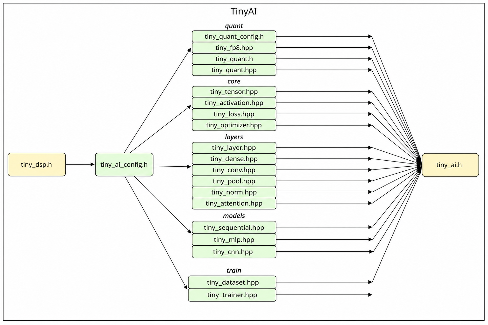

# ARTIFICIAL INTELLIGENCE

!!! note
    This component delivers a lightweight neural-network inference + on-device training stack for edge devices. The whole library is written in C++17 with a minimal dependency footprint, specifically tuned for ESP32-S3 (WROOM-1U) class MCUs that ship with PSRAM.

!!! note
    `tiny_ai` sits at the top of the TinyAuton middleware chain `tiny_toolbox → tiny_math → tiny_dsp → tiny_ai`. It reuses the tensor / matrix primitives in `tiny_math` and the spectral / filtering / resampling building blocks in `tiny_dsp`, forming an end-to-end pipeline from sensor capture to on-device inference.

## COMPONENT DEPENDENCIES

```c
# tiny_ai component CMakeLists.txt

set(src_dirs
    .
    core
    layers
    models
    quant
    train
    example
)

set(include_dirs
    .
    include
    core
    layers
    models
    quant
    train
    example/data
)

set(requires
    tiny_dsp
)

idf_component_register(
    SRC_DIRS    ${src_dirs}
    INCLUDE_DIRS ${include_dirs}
    REQUIRES    ${requires}
)
```

## ARCHITECTURE & FUNCTIONALITY

### Dependency Diagram



### Source Tree

```txt
tiny_ai/
├── include/
│   ├── tiny_ai.h               # unified entry header
│   └── tiny_ai_config.h        # platform / PSRAM / training switch / error codes
│
├── core/                       # tensor & training primitives
│   ├── tiny_tensor.{hpp,cpp}        # N-D (up to 4D) float32 tensor
│   ├── tiny_activation.{hpp,cpp}    # ReLU / LeakyReLU / Sigmoid / Tanh / Softmax / GELU / Linear
│   ├── tiny_loss.{hpp,cpp}          # MSE / MAE / CrossEntropy / BinaryCE
│   └── tiny_optimizer.{hpp,cpp}     # SGD (momentum + L2), Adam
│
├── layers/                     # neural-network layers
│   ├── tiny_layer.{hpp,cpp}         # Layer abstract + ActivationLayer / Flatten / GlobalAvgPool
│   ├── tiny_dense.{hpp,cpp}         # fully-connected layer (Xavier init)
│   ├── tiny_conv.{hpp,cpp}          # Conv1D / Conv2D (He init)
│   ├── tiny_pool.{hpp,cpp}          # MaxPool / AvgPool 1D & 2D
│   ├── tiny_norm.{hpp,cpp}          # LayerNorm
│   └── tiny_attention.{hpp,cpp}     # Multi-Head Self-Attention
│
├── models/                     # high-level containers
│   ├── tiny_sequential.{hpp,cpp}    # Sequential layer stack
│   ├── tiny_mlp.{hpp,cpp}           # MLP convenience wrapper
│   └── tiny_cnn.{hpp,cpp}           # CNN1D convenience wrapper (CNN1DConfig)
│
├── quant/                      # quantisation subsystem
│   ├── tiny_quant_config.h          # tiny_dtype_t / tiny_quant_params_t
│   ├── tiny_quant.{h,c}             # C API: INT8 / INT16 quant + INT8 dense forward
│   ├── tiny_quant.{hpp,cpp}         # C++ Tensor-level PTQ helpers
│   └── tiny_fp8.{hpp,cpp}           # software FP8 E4M3FN / E5M2
│
├── train/                      # training loop
│   ├── tiny_dataset.{hpp,cpp}       # Dataset: shuffle / split / next_batch
│   └── tiny_trainer.{hpp,cpp}       # Trainer: fit / evaluate
│
└── example/                    # end-to-end demos
    ├── data/iris_data.hpp           # Iris classification (150 × 4 → 3 classes)
    ├── data/signal_data.hpp         # synthetic 1-D signals (3 classes, 64 pts each)
    ├── example_mlp.cpp              # MLP + INT8 PTQ demo
    ├── example_cnn.cpp              # CNN1D + FP8 compression demo
    └── example_attention.cpp        # tiny Transformer (Iris)
```

## FEATURE MATRIX

| Feature | Macro / API | Description |
| --- | --- | --- |
| Training switch | `TINY_AI_TRAINING_ENABLED` | Set to 0 for inference-only builds; backward paths and gradient buffers are removed |
| PSRAM allocation | `TINY_AI_USE_PSRAM`, `TINY_AI_MALLOC_PSRAM` | Large tensors live in 8 MB PSRAM, small / hot ones stay in internal SRAM |
| INT8 quant | `TINY_AI_QUANT_INT8` | Symmetric, min-max calibration, INT32-accumulated dense forward |
| INT16 quant | `TINY_AI_QUANT_INT16` | Symmetric, higher-precision fallback |
| FP8 quant | `TINY_AI_QUANT_FP8` | Software OCP E4M3FN (weights/activations) and E5M2 (gradients) |

## DESIGN HIGHLIGHTS

- **C++17 + `namespace tiny`**: every class / function is wrapped inside `namespace tiny`. C interfaces (`tiny_quant.h`, error codes) stay in the global scope.
- **Shape conventions**: `Tensor` supports up to 4 dimensions, row-major. Common layouts: `[batch, ...]`; Conv1D `[B, C, L]`; Conv2D `[B, C, H, W]`; Attention `[B, S, E]`.
- **Backward caches**: when training is enabled, layers stash the inputs / outputs they need (`x_cache_`, `A_cache_`, etc.) inside `forward()` so that `backward()` can skip recomputation.
- **Parameter collection**: `Sequential::collect_params()` recursively collects `(param, grad)` pairs into a `std::vector<ParamGroup>`. The `Optimizer::init()` then sizes its momentum / Adam moment buffers off this list.
- **Quantisation path**: PTQ workflow — `calibrate(weight, dtype)` → `quantize(weight, buf, qp)` → run inference with `tiny_quant_dense_forward_int8()`.
