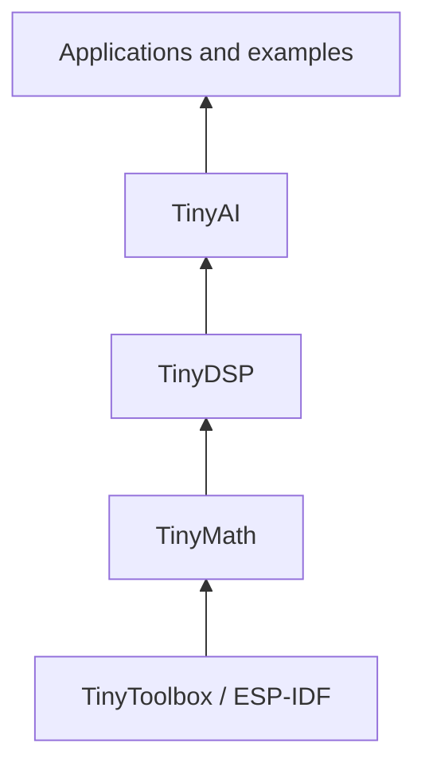

# ARCHITECTURE {#architecture}

## Component dependencies {#auton-component-dependencies}



This graph follows the current component CMake dependencies. Algorithms may call Math directly; CMake still determines component inclusion.

## Portability boundaries {#auton-portability}

| Scope | Current state |
|---|---|
| ESP32-S3 / ESP-IDF | Primary development and configured project target |
| Generic computation branch | Some Math kernels have portable C paths; check each function |
| Toolbox and project build | Direct dependencies on `esp_timer`, `node_rtc`, ESP-DSP, ESP-DL and other components |
| STM32 / RISC-V identifiers | Reserved platform macros, not complete buildable ports |

Porting the entire stack requires adapting tools, build dependencies, platform selection, allocation and direct platform calls. Switching `MCU_PLATFORM_GENERIC` or replacing timing alone does not establish a complete port.

## Reading order {#auton-reading-order}

Start with [getting started](../GETTING_STARTED/getting_started.md) to identify actual entries, then read usage, APIs and tests. Historical coverage and current default execution are documented separately.

## Original layer diagram {#auton-original-diagram}

## LAYERED ARCHITECTURE {#layered-architecture}

```txt
+------------------------------+
| AI                           | <-- AI/ML Functions for Edge Devices based on Low Level Functions
+------------------------------+
| DSP                          | <-- Digital Signal Processing Functions
+------------------------------+
| Math Operations              | <-- Commonly Used Math Functions for Various Applications
+------------------------------+
| Adaptation/Toolbox Layer     | <-- To Replace Functions in Standard C with Platform Optimized/Specific Functions
+------------------------------+
```
