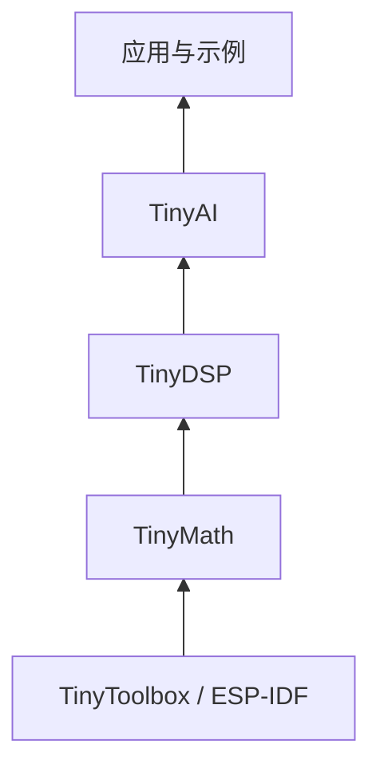

# 架构 {#_1}

## 组件依赖 {#auton-component-dependencies}



此图对应当前 `CMakeLists.txt` 中的组件依赖。算法内部可能直接调用 Math；组件层面的引入仍由 CMake 决定。

## 移植边界 {#auton-portability}

| 范围 | 当前状态 |
|---|---|
| ESP32-S3 / ESP-IDF | 主要开发与工程配置目标 |
| Generic 计算分支 | Math 中部分 kernel 提供纯 C 路径，需按函数检查 |
| Toolbox 与工程构建 | 直接依赖 `esp_timer`、`node_rtc`、ESP-DSP、ESP-DL 等组件 |
| STM32 / RISC-V 宏 | 保留的平台标识，不代表已有可直接构建的完整工程 |

移植整个栈需要处理工具层、构建依赖、平台选择、内存分配和各模块的直接平台调用。仅切换 `MCU_PLATFORM_GENERIC` 或替换时间函数不能证明完整移植已完成。

## 阅读顺序 {#auton-reading-order}

从[快速开始](../GETTING_STARTED/getting_started.md)确认实际入口，再阅读各模块的使用、接口和测试。历史记录的测试范围与当前默认执行范围分别说明。

## 原始分层示意 {#auton-original-diagram}

## 分层架构 {#_2}

```txt
+------------------------------+
| AI                           | <-- 基于低级函数的边缘设备 AI/ML 函数
+------------------------------+
| DSP                          | <-- 数字信号处理函数
+------------------------------+
| Math Operations              | <-- 各种应用的常用数学函数
+------------------------------+
| Adaptation/Toolbox Layer     | <-- 用平台优化/特定函数替换标准 C 中的函数
+------------------------------+
```
