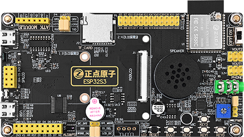
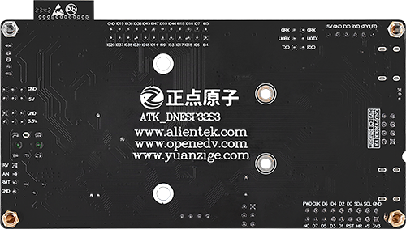
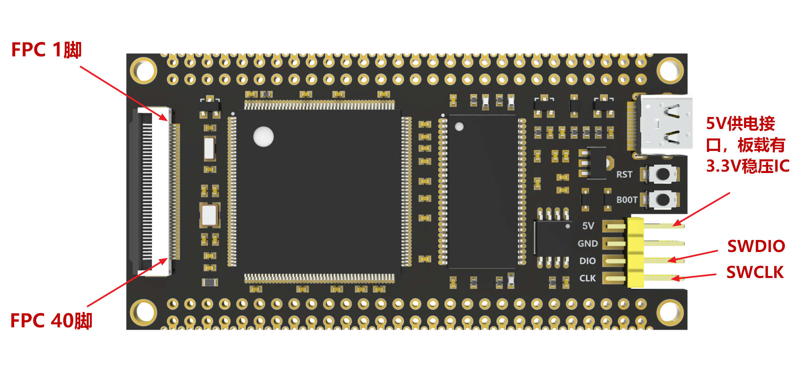

# DEVKITS

## HOST MCU HARDWARES

- DNESP32S3 from Alientek (ESP32-S3)

{width=70%}

{width=70%}

- FK743M2-IIT6 from FANKE (STM32H743)

{width=80%}

{width=70%}

## DEB BOARDS SETUP GUIDANCE

-   :simple-github:{ .lg .middle } __STM32__

    ---

    [:octicons-arrow-right-24: <a href="https://github.com/Shuaiwen-Cui/MCU_NODE_ESP32.git" target="_blank"> Repo </a>](#)

    [:octicons-arrow-right-24: <a href="https://shuaiwen-cui.github.io/MCU_NODE_STM32/" target="_blank"> Online Doc </a>](#)

-   :simple-github:{ .lg .middle } __ESP32__

    ---

    [:octicons-arrow-right-24: <a href="https://github.com/Shuaiwen-Cui/MCU_NODE_ESP32.git" target="_blank"> Repo </a>](#)

    [:octicons-arrow-right-24: <a href="https://shuaiwen-cui.github.io/MCU_NODE_ESP32/" target="_blank"> Online Doc </a>](#)

