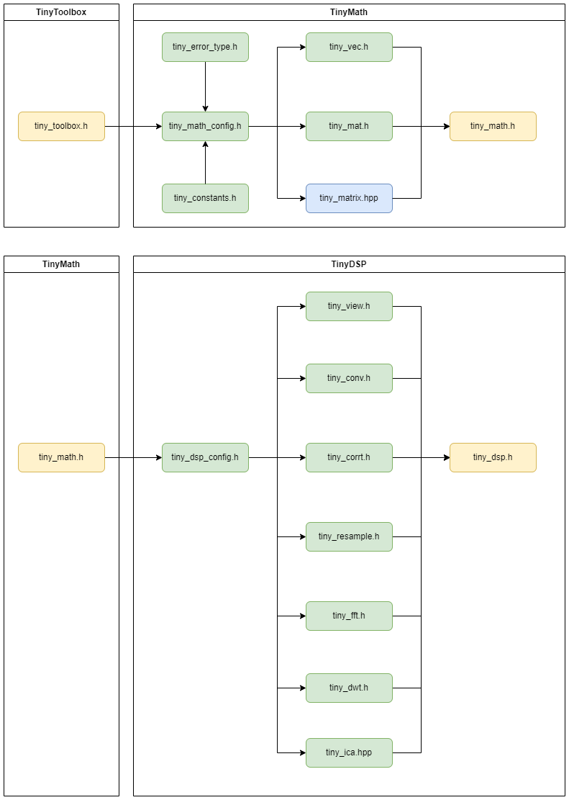

# DIGITAL SIGNAL PROCESSING {#digital-signal-processing}

## Reading entries {#auton-dsp-guide}

[Usage](USAGE/usage.md) · [Convolution](SIGNAL/CONVOLUTION/notes.md) · [Correlation](SIGNAL/CORRELATION/notes.md) · [Resampling](SIGNAL/RESAMPLE/notes.md) · [FIR](FILTER/FIR/notes.md) · [IIR](FILTER/IIR/notes.md) · [FFT](TRANSFORM/FFT/notes.md) · [DWT](TRANSFORM/DWT/notes.md) · [ICA](TRANSFORM/ICA/notes.md).

The DSP entry enables transforms by default; select other groups in the entry. MATH contains an older DSP copy with a different multilevel DWT interface. [FFT tests](TRANSFORM/FFT/test.md) show a complete verification example.

!!! info "Implementation and records"
    APIs in this section are based on `CODE/AIoTNode-TinyAuton-DSP/middleware/`. Source excerpts and serial output include historical records; check the project entry and enabled selectors before reproducing a test.

!!! note
    This component provides a set of functions designed for signal processing on edge devices, with a focus on lightweight and efficient implementations of commonly used signal processing algorithms.

!!! note
    This component is a wrapper and extension of the official ESP32 digital signal processing library [ESP-DSP](https://docs.espressif.com/projects/esp-dsp/en/latest/esp32/index.html), providing higher-level API interfaces. In simple terms, the TinyMath library corresponds to the Math, Matrix, and DotProduct modules in ESP-DSP, while the other modules in ESP-DSP correspond to the TinyDSP library. Additionally, TinyDSP provides some functionalities not available in ESP-DSP, focusing on scenarios such as structural health monitoring.

## COMPONENT DEPENDENCIES {#component-dependencies}

```c
set(src_dirs
    .
    signal
    filter
    transform
    support
)

set(include_dirs
    .
    include
    signal
    filter
    transform
    support
)

set(requires
    tiny_math
)

idf_component_register(SRC_DIRS ${src_dirs} INCLUDE_DIRS ${include_dirs} REQUIRES ${requires})


```

## ARCHITECTURE AND DIRECTORY {#architecture-and-directory}

### Dependency Diagram {#dependency-diagram}



### Code Tree {#code-tree}

```txt
tiny_dsp/
├── include/                     
│   ├── tiny_dsp.h               # entrance header file
│   └── tiny_dsp_config.h        # dsp module configuration file
│
├── signal/
│   ├── tiny_conv.h              # convolution - header file
│   ├── tiny_conv.c              # convolution - source file
│   ├── tiny_conv_test.h         # convolution - test header file
│   ├── tiny_conv_test.c         # convolution - test source file
│   ├── tiny_corr.h              # correlation - header file
│   ├── tiny_corr.c              # correlation - source file
│   ├── tiny_corr_test.h         # correlation - test header file
│   ├── tiny_corr_test.c         # correlation - test source file
│   ├── tiny_resample.h          # resampling - header file
│   ├── tiny_resample.c          # resampling - source file
│   ├── tiny_resample_test.h     # resampling - test header file
│   └── tiny_resample_test.c     # resampling - test source file
│
├── filter/
│   ├── tiny_fir.h               # FIR filter - header file
│   ├── tiny_fir.c               # FIR filter - source file
│   ├── tiny_fir_test.h          # FIR filter - test header file
│   ├── tiny_fir_test.c          # FIR filter - test source file
│   ├── tiny_iir.h               # IIR filter - header file
│   ├── tiny_iir.c               # IIR filter - source file
│   ├── tiny_iir_test.h          # IIR filter - test header file
│   └── tiny_iir_test.c          # IIR filter - test source file
│
├── transform/
│   ├── tiny_fft.h               # fast fourier transform - header file
│   ├── tiny_fft.c               # fast fourier transform - source file
│   ├── tiny_fft_test.h          # fast fourier transform - test header file
│   ├── tiny_fft_test.c          # fast fourier transform - test source file
│   ├── tiny_dwt.h               # discrete wavelet transform - header file
│   ├── tiny_dwt.c               # discrete wavelet transform - source file
│   ├── tiny_dwt_test.h          # discrete wavelet transform - test header file
│   ├── tiny_dwt_test.c          # discrete wavelet transform - test source file
│   ├── tiny_ica.hpp               # independent component analysis - header file
│   ├── tiny_ica.cpp               # independent component analysis - source file
│   ├── tiny_ica_test.hpp          # independent component analysis - test header file
│   └── tiny_ica_test.cpp          # independent component analysis - test source file
│
└── support/
    ├── tiny_view.h              # signal view/support - header file
    ├── tiny_view.c              # signal view/support - source file
    ├── tiny_view_test.h         # signal view/support - test header file
    └── tiny_view_test.c         # signal view/support - test source file
```
