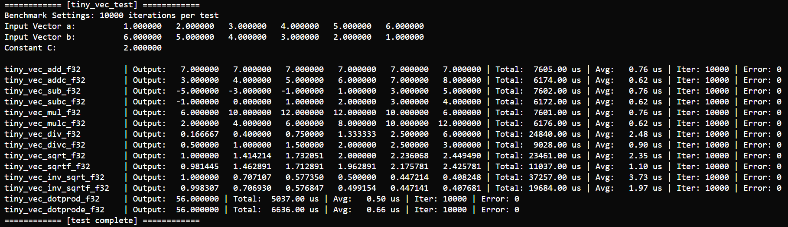
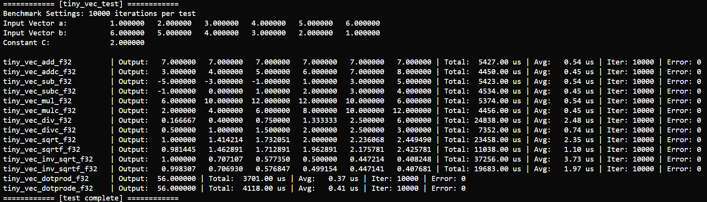

# VECTOR OPERATIONS TEST

!!! note "Vector Operations Test"
    This test is designed to evaluate the performance of vector-related functions.

## Test Code

### tiny_vec_test.h

```c
/**
 * @file tiny_vec_test.h
 * @author SHUAIWEN CUI (SHUAIWEN001@e.ntu.edu.sg)
 * @brief This file is the test header file for the submodule vec of the tiny_math middleware.
 * @version 1.0
 * @date 2025-04-15
 * @copyright Copyright (c) 2025
 */

#pragma once

#include "tiny_math_config.h"
#include "tiny_vec.h"

#ifdef __cplusplus
extern "C"
{
#endif

    /**
     * @name tiny_vec_test
     * @brief Run unit tests and timing benchmarks for the tiny_vec module.
     */
    void tiny_vec_test(void);

#ifdef __cplusplus
}
#endif


```

### tiny_vec_test.c

```c
/**
 * @file tiny_vec_test.c
 * @author SHUAIWEN CUI (SHUAIWEN001@e.ntu.edu.sg)
 * @brief This file implements test functions for the submodule vec of the tiny_math middleware.
 * @version 1.0
 * @date 2025-04-15
 * @copyright Copyright (c) 2025
 */

#include "tiny_vec_test.h"

#define LEN 6
#define ITERATIONS 10000 // Number of iterations for performance benchmarking

#define RUN_VEC_TEST(FUNC, ...)                                                \
    do                                                                         \
    {                                                                          \
        tiny_error_t err = TINY_OK;                                            \
        int actual_iter = 0;                                                   \
        TinyTimeMark_t t0 = tiny_get_running_time();                           \
        for (int iter = 0; iter < ITERATIONS; iter++)                          \
        {                                                                      \
            err = FUNC(__VA_ARGS__);                                           \
            actual_iter++;                                                     \
            if (err != TINY_OK)                                                \
                break;                                                         \
        }                                                                      \
        TinyTimeMark_t t1 = tiny_get_running_time();                           \
        double dt_total = (double)(t1 - t0);                                   \
        double dt_avg = (actual_iter > 0) ? dt_total / actual_iter : 0.0;     \
        printf("%-24s | Output: ", #FUNC);                                     \
        for (int i = 0; i < LEN; i++)                                          \
        {                                                                      \
            printf("%10.6f ", out[i]);                                         \
        }                                                                      \
        printf("| Total: %8.2f us | Avg: %6.2f us | Iter: %d | Error: %d\n\r", \
               dt_total, dt_avg, actual_iter, err);                            \
    } while (0)

void tiny_vec_test(void)
{
    float a[] = {1.0f, 2.0f, 3.0f, 4.0f, 5.0f, 6.0f};
    float b[] = {6.0f, 5.0f, 4.0f, 3.0f, 2.0f, 1.0f};
    float out[LEN];
    float C = 2.0f;
    float dot_result = 0.0f;

    printf("============ [tiny_vec_test] ============\n\r");
    printf("Benchmark Settings: %d iterations per test\n\r", ITERATIONS);

    printf("Input Vector a:        ");
    for (int i = 0; i < LEN; i++)
        printf("%10.6f ", a[i]);
    printf("\n\r");

    printf("Input Vector b:        ");
    for (int i = 0; i < LEN; i++)
        printf("%10.6f ", b[i]);
    printf("\n\r");

    printf("Constant C:            %10.6f\n\r\n\r", C);

    RUN_VEC_TEST(tiny_vec_add_f32, a, b, out, LEN, 1, 1, 1);
    RUN_VEC_TEST(tiny_vec_addc_f32, a, out, LEN, C, 1, 1);
    RUN_VEC_TEST(tiny_vec_sub_f32, a, b, out, LEN, 1, 1, 1);
    RUN_VEC_TEST(tiny_vec_subc_f32, a, out, LEN, C, 1, 1);
    RUN_VEC_TEST(tiny_vec_mul_f32, a, b, out, LEN, 1, 1, 1);
    RUN_VEC_TEST(tiny_vec_mulc_f32, a, out, LEN, C, 1, 1);
    RUN_VEC_TEST(tiny_vec_div_f32, a, b, out, LEN, 1, 1, 1, true);
    RUN_VEC_TEST(tiny_vec_divc_f32, a, out, LEN, C, 1, 1, true);
    RUN_VEC_TEST(tiny_vec_sqrt_f32, a, out, LEN);
    RUN_VEC_TEST(tiny_vec_sqrtf_f32, a, out, LEN);
    RUN_VEC_TEST(tiny_vec_inv_sqrt_f32, a, out, LEN);
    RUN_VEC_TEST(tiny_vec_inv_sqrtf_f32, a, out, LEN);

    // Dot product (non-strided)
    {
        tiny_error_t err = TINY_OK;
        int actual_iter = 0;
        TinyTimeMark_t t0 = tiny_get_running_time();
        for (int iter = 0; iter < ITERATIONS; iter++)
        {
            err = tiny_vec_dotprod_f32(a, b, &dot_result, LEN);
            actual_iter++;
            if (err != TINY_OK)
                break;
        }
        TinyTimeMark_t t1 = tiny_get_running_time();
        double dt_total = (double)(t1 - t0);
        double dt_avg = (actual_iter > 0) ? dt_total / actual_iter : 0.0;
        printf("%-24s | Output: %10.6f | Total: %8.2f us | Avg: %6.2f us | Iter: %d | Error: %d\n\r",
               "tiny_vec_dotprod_f32", dot_result, dt_total, dt_avg, actual_iter, err);
    }

    // Dot product (strided)
    {
        tiny_error_t err = TINY_OK;
        int actual_iter = 0;
        TinyTimeMark_t t0 = tiny_get_running_time();
        for (int iter = 0; iter < ITERATIONS; iter++)
        {
            err = tiny_vec_dotprode_f32(a, b, &dot_result, LEN, 1, 1);
            actual_iter++;
            if (err != TINY_OK)
                break;
        }
        TinyTimeMark_t t1 = tiny_get_running_time();
        double dt_total = (double)(t1 - t0);
        double dt_avg = (actual_iter > 0) ? dt_total / actual_iter : 0.0;
        printf("%-24s | Output: %10.6f | Total: %8.2f us | Avg: %6.2f us | Iter: %d | Error: %d\n\r",
               "tiny_vec_dotprode_f32", dot_result, dt_total, dt_avg, actual_iter, err);
    }

    printf("============ [test complete] ============\n\r");
}
```

### main.cpp

```cpp
#include "tiny_vec_test.h"

extern "C" void app_main(void)
{
    tiny_vec_test();
}

```

## Test Output

Basic C computation results



ESP-DSP accelerated results



You can see that with ESP-DSP acceleration enabled, the performance of vector operations is significantly improved.