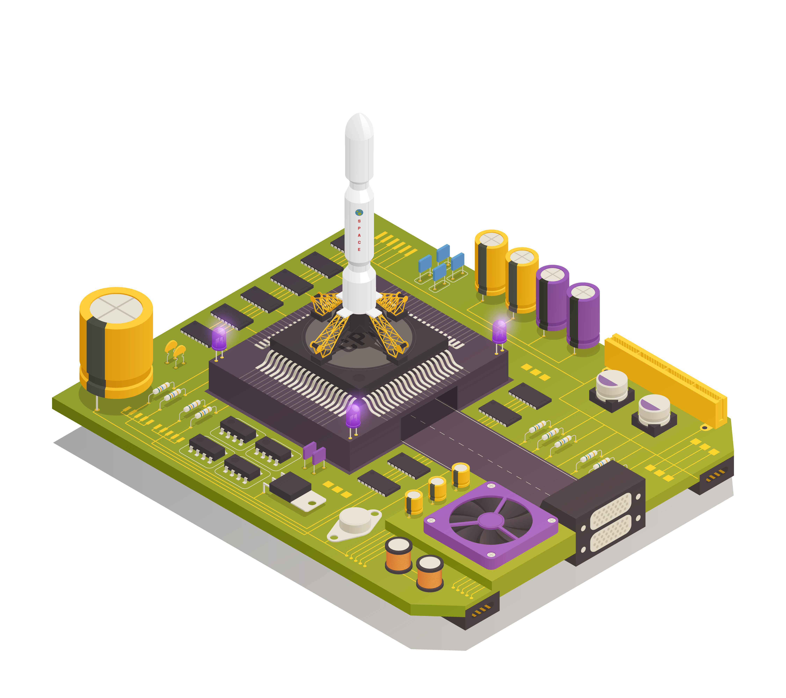
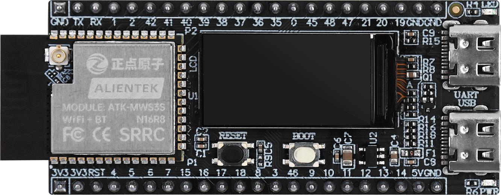
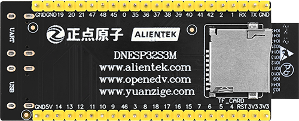
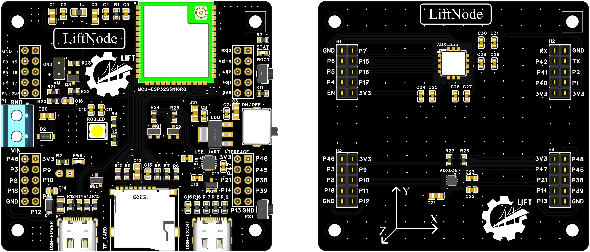

# TinyAuton {#tinyauton-microcontroller-oriented-distributed-intelligence-framework}

Numerics, signal processing and on-device neural network training for autonomous MCU computation. The primary implementation target is ESP32-S3 with ESP-IDF.

<div class="grid cards auton-entry-grid" markdown>

- :material-compass-outline: **Get started**

    Choose a project, build firmware and trace actual execution.

    [Getting started →](GETTING_STARTED/getting_started.md)

- :material-package-variant: **Projects and versions**

    Components, default tests and differences between copies.

    [Choose a project →](PROJECTS/projects.md)

- :material-chart-line: **Read verification results**

    Inputs, results and criteria before full source listings.

    [FFT tests →](DSP/TRANSFORM/FFT/test.md)

</div>

## Choose a module by task {#auton-module-guide}

| Task | Start here |
|---|---|
| Vectors and matrices | [Math](MATH/math.md) |
| Convolution, filters, FFT, wavelets and ICA | [DSP](DSP/dsp.md) |
| Networks, training and quantization | [AI](AI/ai.md) |
| Runtime measurement and wall time | [Toolbox](TOOLBOX/toolbox.md) |

This repository provides computation libraries and independent example projects. See [architecture](ARCHITECTURE/architecture.md) for platform boundaries.

{ .auton-cover }

## ABOUT THIS PROJECT {#about-this-project}

This project dedicates to the development of a library for tiny agent related computing running on MCU devices to serve the multi-agent system，covering mathematical operations, digital signal processing, and TinyML. 

!!! info "About the Name"
    The name "TinyAuton" is a combination of "Tiny" and "Auton". "Tiny" means the agent is designed to run on MCU devices, and "Auton" is short for "Autonomous Agent".

## TARGET HARDWARE {#target-hardware}

- MCU devices (currently targeting ESP32 as the main platform)

## SCOPE {#scope}

- Platform adaptation and various tools (time, communication, etc.)
- Basic Math Operations
- Digital Signal Processing
- TinyML / Edge AI


## HOST DEVKITS {#host-devkits}

!!! TIP 
    The following hardwares are for demonstration purposes only. This project is not limited to these and can be ported to other types of hardwares.

- DNESP32S3M from Alientek (ESP32-S3)

{ .auton-hardware }

{ .auton-hardware }

- NexNode AIoT Node

{ .auton-hardware }

{ .auton-hardware }

<div class="grid cards" markdown>

-   :simple-github:{ .lg .middle } __NexNode__

    ---

    [:octicons-arrow-right-24: <a href="https://github.com/Shuaiwen-Cui/NexNode.git" target="_blank"> Repo </a>](#)

    [:octicons-arrow-right-24: <a href="http://www.cuishuaiwen.com:9100/" target="_blank"> Online Doc </a>](#)


</div>

## PROJECT ARCHITECTURE {#project-architecture}

```txt
+------------------------------+
| APPLICATION                  |
+------------------------------+
|   - TinyAI                   | <-- AI Functions
|   - TinyDSP                  | <-- DSP Functions
|   - TinyMath                 | <-- Common Math Functions
|   - TinyToolbox              | <-- Platform-specific Low-level Optimization + Various Utilities
| MIDDLEWARE                   |
+------------------------------+
| DRIVERS                      |
+------------------------------+
| HARDWARE                     |
+------------------------------+
```
