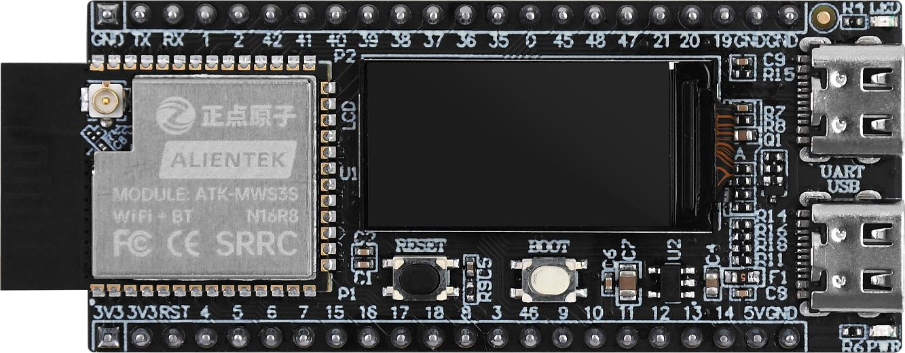

# TINYAUTON


## 关于本项目

这个项目致力于开发一个运行在 MCU 设备上的小型智能体相关的计算库，以服务于多智能体系统，涵盖数学运算、数字信号处理和 TinyML。

!!! info "名字的由来"
    "TinyAuton" 是 "Tiny" 和 "Auton" 的组合。"Tiny" 意味着智能体被设计为运行在 MCU 设备上，而 "Auton" 是 "Autonomous Agent" 的缩写。

## 目标硬件

- MCU 设备（目前以 ESP32 为主要目标）

## 覆盖范围

- 平台适配与各类各类工具（时间、通讯等）
- 基本数学运算
- 数字信号处理
- TinyML / 边缘人工智能


## 开发载体

!!! TIP 
    以下硬件仅做展示用途，本项目并不局限于此，可以移植到其他类型的硬件上。

- Alientek 的 DNESP32S3M（ESP32-S3）

{width=800px}

{width=800px}

<div class="grid cards" markdown>

-   :simple-github:{ .lg .middle } __NexNode__

    ---

    [:octicons-arrow-right-24: <a href="https://github.com/Shuaiwen-Cui/NexNode.git" target="_blank"> 代码 </a>](#)

    [:octicons-arrow-right-24: <a href="http://www.cuishuaiwen.com:9100/" target="_blank"> 文档 </a>](#)


</div>

## 项目架构

```txt
+------------------------------+
| 应用层                        |
+------------------------------+
|   - TinyAI                   | <-- AI 函数
|   - TinyDSP                  | <-- DSP 函数
|   - TinyMath                 | <-- 常用数学函数
|   - TinyToolbox              | <-- 平台底层优化 + 各种工具
| 中间件                        |
+------------------------------+
| 驱动层                        |
+------------------------------+
| 硬件层                        |
+------------------------------+

```